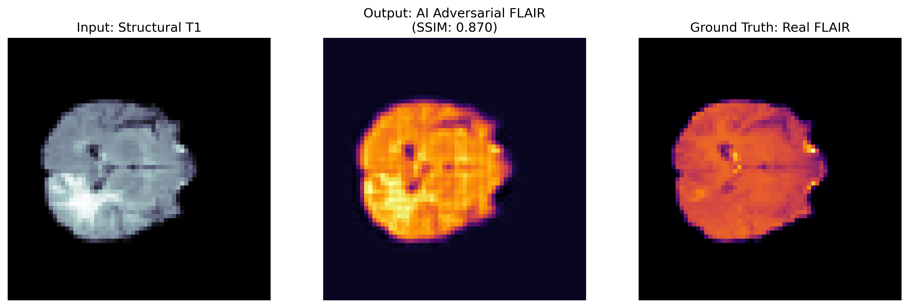

# 3D Brain Cross-Modal Translation via Deep Attention Adversarial Networks

An independent computational neuroscience project implementing a specialized 3D Generative Adversarial Network (GAN) to synthesize Fluid-Attenuated Inversion Recovery (FLAIR) sequences directly from standard, rapid T1-weighted structural MRI volumes.

## 🧠 Clinical Significance
FLAIR imaging is crucial for isolating neuroinflammatory, demyelinating, and neoplastic diseases in clinical neurology. However, physical acquisition is throttled by long scanner times and patient motion artifacts. This software-driven approach establishes a high-velocity path toward virtual sequence synthesis, reducing hospital overhead and scanning times.

## 🛠️ Architecture Highlights
* **Generator:** 3D Residually-Gated CNN embedded with custom non-local spatial routing gates (`AttentionGate3D`) to isolate structural margins.
* **Discriminator:** 3D Patch-GAN Architecture acting as an automated, localized convolutional radiology reviewer.
* **Loss Dynamics:** Balanced optimization utilizing strict L1-voxel spatial distance constraints coupled with native Binary Cross-Entropy (BCE) adversarial regularization.

## 📊 Performance & Validation Metrics
Tested on **388 high-resolution 3D multi-modal scans (7.09 GB)** from the Medical Segmentation Decathlon dataset.

* **Final Training Loss (Generator):** 1.8179
* **Final Training Loss (Discriminator):** 0.6599
* **Validation Structural Similarity Index (SSIM):** **0.870**

### Cross-Modal Synthesis Output Validation
The network demonstrates exceptional fidelity in reconstructing macro-morphology and pathologically hyperintense tissue interfaces:

